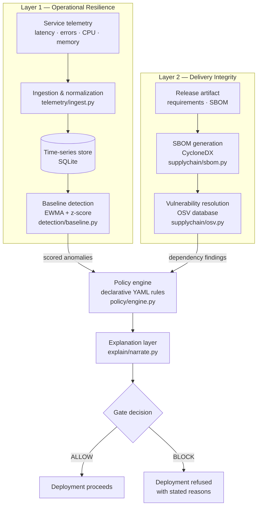
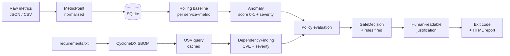
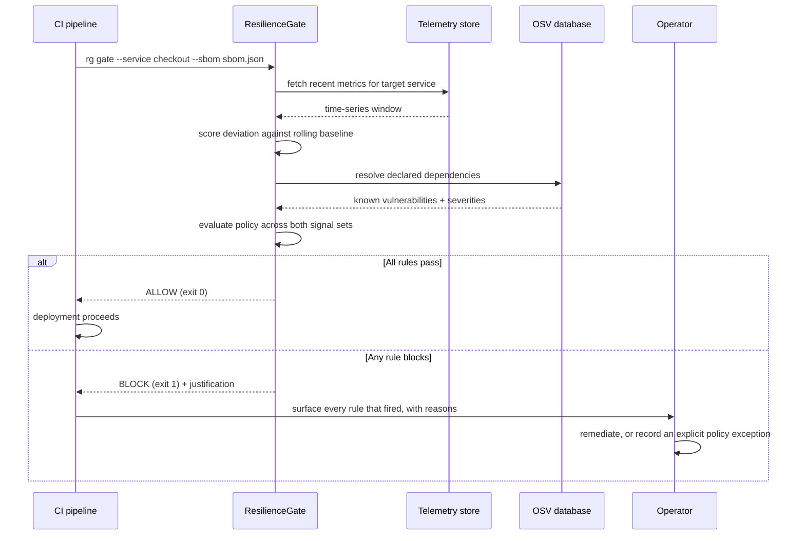

# ResilienceGate — Architecture

## 1. System Architecture

The two layers are independent up to the policy engine and converge at a single decision point. That convergence is the design claim: neither operational state nor artifact integrity is sufficient alone.

## 2. Data Flow

## 3. Deployment Gate Sequence

The operator branch is deliberate. The system refuses a deployment and explains itself; it does not act unilaterally without recourse. This is the human-oversight boundary described in the XR-ACD framework.
