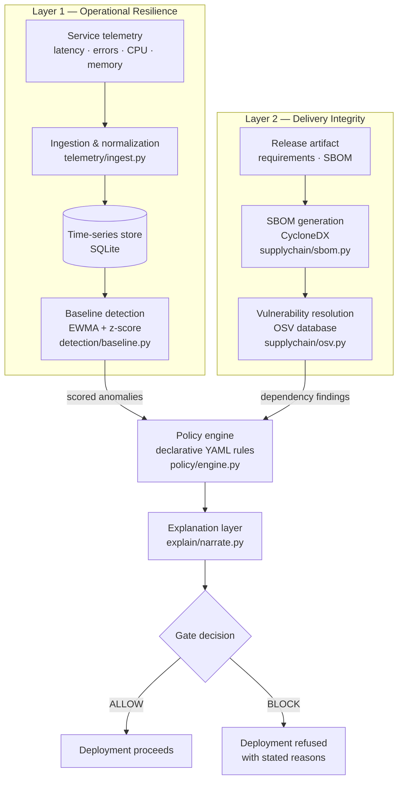

# ResilienceGate — Architecture

## 1. System Architecture

The two layers are independent up to the policy engine and converge at a single decision point. That convergence is the design claim: neither operational state nor artifact integrity is sufficient alone.
